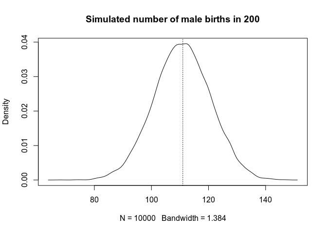
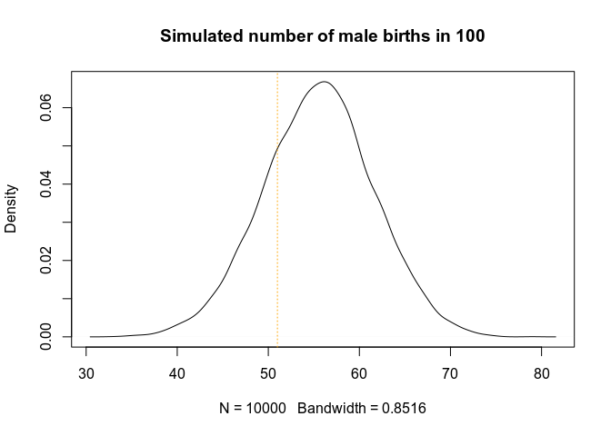
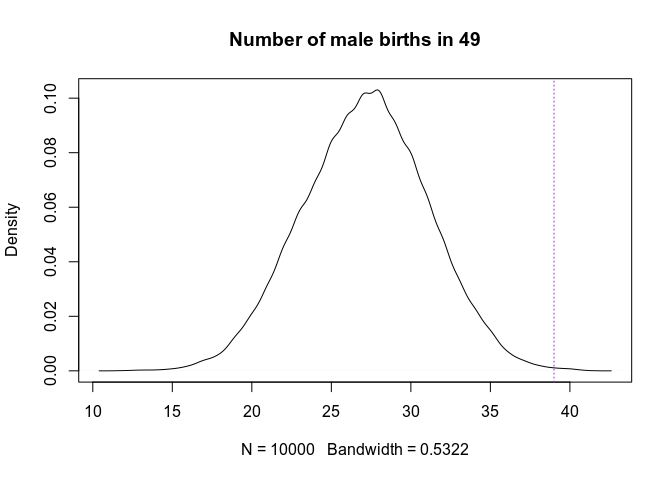

Chapter 3: Sampling the Imaginary
================

``` r
library(rethinking)
library(magrittr)
data(homeworkch3)
sessionInfo()
```

    ## R version 3.5.2 (2018-12-20)
    ## Platform: x86_64-pc-linux-gnu (64-bit)
    ## Running under: Ubuntu 19.04
    ## 
    ## Matrix products: default
    ## BLAS: /usr/lib/x86_64-linux-gnu/blas/libblas.so.3.8.0
    ## LAPACK: /usr/lib/x86_64-linux-gnu/lapack/liblapack.so.3.8.0
    ## 
    ## locale:
    ##  [1] LC_CTYPE=en_US.UTF-8       LC_NUMERIC=C              
    ##  [3] LC_TIME=nl_NL.UTF-8        LC_COLLATE=en_US.UTF-8    
    ##  [5] LC_MONETARY=nl_NL.UTF-8    LC_MESSAGES=en_US.UTF-8   
    ##  [7] LC_PAPER=nl_NL.UTF-8       LC_NAME=C                 
    ##  [9] LC_ADDRESS=C               LC_TELEPHONE=C            
    ## [11] LC_MEASUREMENT=nl_NL.UTF-8 LC_IDENTIFICATION=C       
    ## 
    ## attached base packages:
    ## [1] parallel  stats     graphics  grDevices utils     datasets  methods  
    ## [8] base     
    ## 
    ## other attached packages:
    ## [1] magrittr_1.5          rethinking_1.59       rstan_2.19.2         
    ## [4] ggplot2_3.2.0         StanHeaders_2.18.1-10
    ## 
    ## loaded via a namespace (and not attached):
    ##  [1] Rcpp_1.0.2         pillar_1.4.2       compiler_3.5.2    
    ##  [4] prettyunits_1.0.2  tools_3.5.2        digest_0.6.20     
    ##  [7] pkgbuild_1.0.3     lattice_0.20-38    evaluate_0.14     
    ## [10] tibble_2.1.3       gtable_0.3.0       pkgconfig_2.0.2   
    ## [13] rlang_0.4.0        cli_1.1.0          yaml_2.2.0        
    ## [16] mvtnorm_1.0-11     xfun_0.8           loo_2.1.0         
    ## [19] coda_0.19-3        gridExtra_2.3      withr_2.1.2       
    ## [22] stringr_1.4.0      knitr_1.23         stats4_3.5.2      
    ## [25] grid_3.5.2         inline_0.3.15      R6_2.4.0          
    ## [28] processx_3.4.1     rmarkdown_1.14     callr_3.3.1       
    ## [31] MASS_7.3-51.1      matrixStats_0.54.0 scales_1.0.0      
    ## [34] ps_1.3.0           htmltools_0.3.6    assertthat_0.2.1  
    ## [37] colorspace_1.4-1   stringi_1.4.3      lazyeval_0.2.2    
    ## [40] munsell_0.5.0      crayon_1.3.4

Easy
----

Same setup as the globe-tossing example in the chapter

``` r
grid_size <- 1000
num_samples <- 1e4
p_grid <- seq(from=0, to=1, length.out=grid_size)
prior <- rep(1, grid_size)

binom_likelihood <- function(prob, trials, successes) {
  # Return vector of likelihood weights corresponding to
  # success probability `prob` given a fixed number of `trials`
  # and `successes`
  return(dbinom(x=successes, size=trials, prob=prob))
}

likelihood <- binom_likelihood(p_grid, 9, 6)  ## example in text
posterior <- prior * likelihood
posterior <- posterior / sum(posterior)

set.seed(100)
samples <- sample(p_grid, prob=posterior, size=num_samples, replace=TRUE)
hist(samples, breaks=50)
```


### 3E1

How much posterior probability lies below *p* = 0.2?

``` r
mean(samples < 0.2)
```

    ## [1] 5e-04

### 3E2

How much posterior probability lies above *p* = 0.8?

``` r
mean(samples > 0.8)
```

    ## [1] 0.1117

### 3E3

How much posterior probability lies between *p* = 0.2 and *p* = 0.8?

``` r
mean(samples >= 0.2 & samples <= 0.8)
```

    ## [1] 0.8878

### 3E4

20% of the posterior probability lies below which value of *p*?

``` r
quantile(samples, probs=0.2)
```

    ##       20% 
    ## 0.5195195

### 3E5

20% of the posterior probability lies above which value of *p*?

``` r
quantile(samples, probs=0.8)
```

    ##       80% 
    ## 0.7567568

### 3E6

What is the narrowest 66% interval for the posterior probability?

``` r
HPDI(samples, prob=0.66)
```

    ##     |0.66     0.66| 
    ## 0.5205205 0.7847848

### 3E7

What is the 66% interval that has the same probability above and below it?

``` r
PI(samples, prob=0.66)  ## using the function in rethinking
```

    ##       17%       83% 
    ## 0.5005005 0.7687688

``` r
prob_tail = (1 - 0.66) / 2
quantile(samples, probs=c(prob_tail, 1-prob_tail)) ## using base functions
```

    ##       17%       83% 
    ## 0.5005005 0.7687688

Medium
------

### 3M1

Suppose the sequence was 8 water in 15 tosses. Construct the posterior starting from the same prior.

``` r
likelihood2 = binom_likelihood(prob=p_grid, trials=15, successes=8)
posterior2 = prior * likelihood2
posterior2 = posterior2 / sum(posterior2)
plot(p_grid, posterior2, type='l', lwd=2)
abline(v=0.5, lty=3)
```


### 3M2

Draw 10^{4} samples from this new distribution. What is the 90% HPDI for p?

``` r
samples2 = sample(p_grid, size=num_samples, prob=posterior2, replace=TRUE)
HPDI(samples2, .9)
```

    ##      |0.9      0.9| 
    ## 0.3383383 0.7317317

### 3M3

Construct a posterior predictive check from this model. What is the probability of observing 8 water in 15 tosses?

``` r
water_in_15 = rbinom(n=num_samples, size=15, prob=samples2)
mean(water_in_15 == 8)
```

    ## [1] 0.1428

``` r
water_in_15 %>% table %>% barplot
```


### 3M4

Keeping the posterior from the 8 out of 15 data, calculate the probabilty of observing 6 water in 9 tosses.

``` r
water_in_9 = rbinom(n=num_samples, size=9, prob=samples2)
mean(water_in_9 == 6)
```

    ## [1] 0.1695

``` r
water_in_9 %>% table %>% barplot
```


### 3M5

Repeat 3M1 - 3M4 starting from a prior that is 0 below *p* = 0.5 and constant otherwise.

``` r
# define new prior
prior3 = ifelse(p_grid < 0.5, 0, 1)
rle(prior3)  ## checking, should be two chunks of 500
```

    ## Run Length Encoding
    ##   lengths: int [1:2] 500 500
    ##   values : num [1:2] 0 1

``` r
# get new posterior
posterior3 = prior3 * likelihood2
posterior3 = posterior3 / sum(posterior3)
plot(p_grid, posterior3, type='l', lwd=2, col='orange')
```


``` r
# get samples of p and the 90% highest posterior density interval
samples3 = sample(p_grid, size=num_samples, prob=posterior3, replace=TRUE)
HPDI(samples3, prob=0.9)
```

    ##      |0.9      0.9| 
    ## 0.5005005 0.7097097

``` r
hist(samples3, breaks=50)
```


``` r
# what's the chance of getting 8 water in 15 tosses from generated data?
water_in_15_new = rbinom(n=num_samples, size=15, prob=samples3)
mean(water_in_15_new == 8)
```

    ## [1] 0.1592

``` r
water_in_15_new %>% table %>% barplot
```


``` r
# what's the chance of getting 6 water in 9 using the same distro for p?
water_in_9_new = rbinom(n=num_samples, size=9, prob=samples3)
mean(water_in_9_new == 6)
```

    ## [1] 0.2357

``` r
water_in_9_new %>% table %>% barplot
```


Hard
----

All problems use the same data available in the book package. The data shows the gender for the first child `birth1` and the second child `birth2` for 100 2-child families (male: 1, female: 0).

### 3H1

``` r
prior4 <- rep(1, grid_size)
all_births = c(birth1, birth2)
likelihood4 = binom_likelihood(prob=p_grid,
                               trials=length(all_births),
                               successes=sum(all_births))
posterior4 = prior4 * likelihood4
posterior4 = posterior4/sum(posterior4)
(p_max = p_grid[which.max(posterior4)])   ## define and return
```

    ## [1] 0.5545546

``` r
plot(p_grid, posterior4, type='h', col='grey')
abline(v=p_max, lty=3)
```


### 3H2

Draw 10^{4} samples from the posterior above. Get the 50%, 89%, and 97% highest density posterior intervals.

``` r
samples4 = sample(p_grid, size=num_samples, prob=posterior4, replace=TRUE)
HPDI(samples=samples4, 0.5)
```

    ##      |0.5      0.5| 
    ## 0.5255255 0.5725726

``` r
HPDI(samples=samples4, 0.89)
```

    ##     |0.89     0.89| 
    ## 0.5015015 0.6116116

``` r
HPDI(samples=samples4, 0.97)
```

    ##     |0.97     0.97| 
    ## 0.4764765 0.6286286

### 3H3

Simulate 10^{4} of male births in 200 childbirths based on the current model. Show the distribution of this number and compare it to the outcome in the data of 111 males.

``` r
males_in_200 = rbinom(num_samples, size=200, prob=samples4)
males_in_200 %>% density %>% plot(main='Simulated number of male births in 200')
abline(v=sum(all_births), lty=3)
```



### 3H4

Do the same thing for the 100 first-born births.

``` r
males_in_100 = rbinom(num_samples, size=100, prob=samples4)
males_in_100 %>% density %>% plot(main='Simulated number of male births in 100')
abline(v=sum(birth1), lty=3, col='orange')
```



### 3H5

Focus on the births of those boys who followed girls. Find out how many times this happened (number of attempts) and how often these were boys (number of successes, in this notation).

``` r
# get basic data
first_girl = birth1 == 0
birth_after_girl = birth2[first_girl]
(trials_after_girl = length(birth_after_girl))
```

    ## [1] 49

``` r
(num_boy_after_girl = sum(birth_after_girl))
```

    ## [1] 39

``` r
# simulate
males_after_girl = rbinom(num_samples, size=trials_after_girl, prob=samples4)
males_after_girl %>% density %>% plot(main=paste('Number of male births in', trials_after_girl))
abline(v=num_boy_after_girl, lty=3, col='purple')
```


