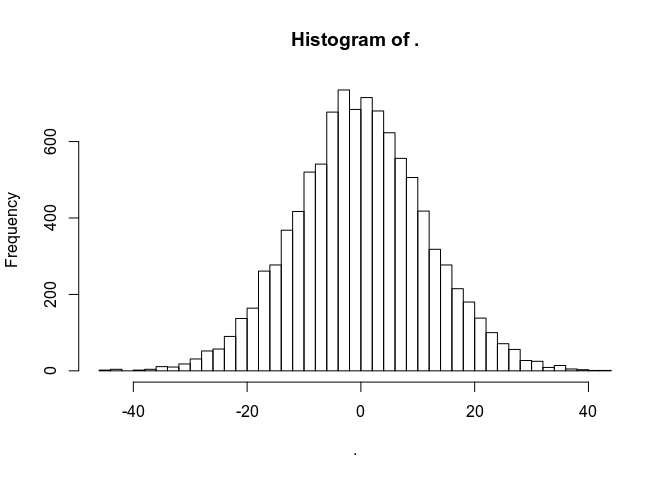
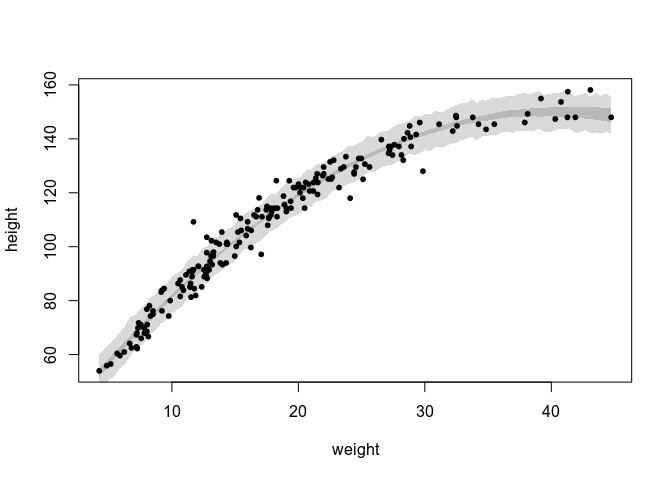
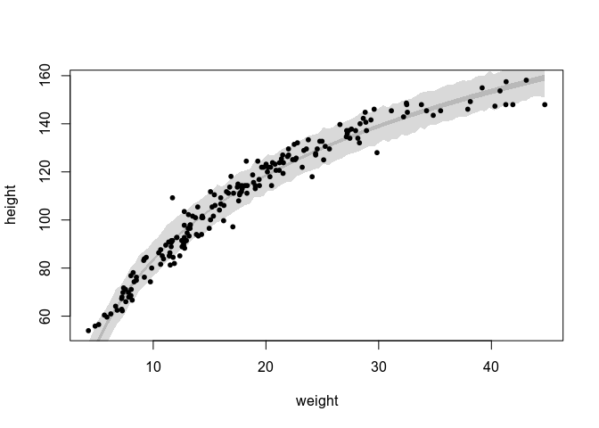

    library(rethinking)
    library(magrittr)
    set.seed(2020)
    sessionInfo()

    ## R version 3.5.2 (2018-12-20)
    ## Platform: x86_64-pc-linux-gnu (64-bit)
    ## Running under: Ubuntu 19.04
    ## 
    ## Matrix products: default
    ## BLAS: /usr/lib/x86_64-linux-gnu/blas/libblas.so.3.8.0
    ## LAPACK: /usr/lib/x86_64-linux-gnu/lapack/liblapack.so.3.8.0
    ## 
    ## locale:
    ##  [1] LC_CTYPE=en_US.UTF-8       LC_NUMERIC=C              
    ##  [3] LC_TIME=nl_NL.UTF-8        LC_COLLATE=en_US.UTF-8    
    ##  [5] LC_MONETARY=nl_NL.UTF-8    LC_MESSAGES=en_US.UTF-8   
    ##  [7] LC_PAPER=nl_NL.UTF-8       LC_NAME=C                 
    ##  [9] LC_ADDRESS=C               LC_TELEPHONE=C            
    ## [11] LC_MEASUREMENT=nl_NL.UTF-8 LC_IDENTIFICATION=C       
    ## 
    ## attached base packages:
    ## [1] parallel  stats     graphics  grDevices utils     datasets  methods  
    ## [8] base     
    ## 
    ## other attached packages:
    ## [1] magrittr_1.5          rethinking_1.59       rstan_2.19.2         
    ## [4] ggplot2_3.2.0         StanHeaders_2.18.1-10
    ## 
    ## loaded via a namespace (and not attached):
    ##  [1] Rcpp_1.0.2         pillar_1.4.2       compiler_3.5.2    
    ##  [4] prettyunits_1.0.2  tools_3.5.2        digest_0.6.20     
    ##  [7] pkgbuild_1.0.3     lattice_0.20-38    evaluate_0.14     
    ## [10] tibble_2.1.3       gtable_0.3.0       pkgconfig_2.0.2   
    ## [13] rlang_0.4.0        cli_1.1.0          yaml_2.2.0        
    ## [16] mvtnorm_1.0-11     xfun_0.8           loo_2.1.0         
    ## [19] coda_0.19-3        gridExtra_2.3      withr_2.1.2       
    ## [22] dplyr_0.8.3        stringr_1.4.0      knitr_1.23        
    ## [25] stats4_3.5.2       grid_3.5.2         tidyselect_0.2.5  
    ## [28] glue_1.3.1         inline_0.3.15      R6_2.4.0          
    ## [31] processx_3.4.1     rmarkdown_1.14     purrr_0.3.2       
    ## [34] callr_3.3.1        MASS_7.3-51.1      matrixStats_0.54.0
    ## [37] ps_1.3.0           scales_1.0.0       htmltools_0.3.6   
    ## [40] assertthat_0.2.1   colorspace_1.4-1   stringi_1.4.3     
    ## [43] lazyeval_0.2.2     munsell_0.5.0      crayon_1.3.4

    data(Howell1)

Medium
------

### 4M1

    nsamples = 1e4
    prior_sample_m1 = rnorm(n=nsamples,
                            mean=rnorm(nsamples, 0, 10),
                            sd=runif(nsamples, 0, 10))
    prior_sample_m1 %>% hist(breaks=50)

### 4M2

    model_m2 <- alist(
      y ~ dnorm(mu, sigma),
      mu ~ dnorm(0, 10),
      sigma ~ dunif(0, 10)
    )

### 4M3

 \\
    \mu_i &= \alpha + \beta x_i \\
    \alpha &\sim \text{Normal}(0, 50) \\
    \beta &\sim \text{Uniform}(0, 10) \\
    \sigma &\sim \text{Uniform}(0, 50)
  \end{align*}
")

### 4M4

All units are in centimeters. I'm assuming "students" means university
students.

 \\
    \mu_i &= \alpha + \beta x_i \\
    \alpha &= \text{Normal}(160, 20) \\
    \beta &= \text\{Uniform}(0, 20) \\
    \sigma &= \text{Uniform}(0, 20)
  \end{align*}
")

### 4M5

I already assumed students get taller every year
( cannot
be negative). Based on the new information, my prior for
 is
now
").
I've narrowed the standard deviation, because 20 seems excessive given
the mean is 120. It would imply there is a reasonable chance we have
students of of 80cm.

### 4M6

That means the standard deviation
 is
never higher than 8cm. So it's prior now becomes:
").

Hard
----

### 4H1

Let's refit a simple model, and then produce estimates for these points.

    dd <- Howell1
    w_mean <- mean(dd$weight)
    w_sd <- sd(dd$weight)
    dd$weight_c <- (dd$weight - w_mean) / w_sd
    dd$weight_c2 <- dd$weight_c^2

    m4h1 <- map(
      alist(
        height ~ dnorm(mu, sigma),
        mu <- a + b * weight_c + c * weight_c2,
        a ~ dnorm(168, 100),
        b ~ dnorm(0, 20),
        c ~ dnorm(0, 10),
        sigma ~ dunif(0, 50)
      ), data=dd)
    m4h1

    ## 
    ## Maximum a posteriori (MAP) model fit
    ## 
    ## Formula:
    ## height ~ dnorm(mu, sigma)
    ## mu <- a + b * weight_c + c * weight_c2
    ## a ~ dnorm(168, 100)
    ## b ~ dnorm(0, 20)
    ## c ~ dnorm(0, 10)
    ## sigma ~ dunif(0, 50)
    ## 
    ## MAP values:
    ##          a          b          c      sigma 
    ## 146.656878  21.413922  -8.409001   5.749510 
    ## 
    ## Log-likelihood: -1723.45

    weight_x <- c(46.95, 43.72, 64.78, 32.59, 54.63)
    weight_xc <- (weight_x - w_mean) / w_sd
    weight_xc2 <- weight_xc^2
    pred_4h1 <- sim(m4h1, data=data.frame(weight_c=weight_xc, weight_c2=weight_xc2))

    ## [ 100 / 1000 ]
    [ 200 / 1000 ]
    [ 300 / 1000 ]
    [ 400 / 1000 ]
    [ 500 / 1000 ]
    [ 600 / 1000 ]
    [ 700 / 1000 ]
    [ 800 / 1000 ]
    [ 900 / 1000 ]
    [ 1000 / 1000 ]

    cbind(weight_x, colMeans(pred_4h1), t(apply(pred_4h1, 2, HPDI)))

    ##      weight_x             |0.89    0.89|
    ## [1,]    46.95 158.3304 149.4300 167.4984
    ## [2,]    43.72 155.7779 145.7122 164.3361
    ## [3,]    64.78 155.9012 147.2112 166.2618
    ## [4,]    32.59 141.7331 132.3722 150.0806
    ## [5,]    54.63 160.1430 150.8038 169.1446

### 4H2

    dd2 <- Howell1[Howell1$age < 18, ]
    str(dd2)

    ## 'data.frame':    192 obs. of  4 variables:
    ##  $ height: num  121.9 105.4 86.4 129.5 109.2 ...
    ##  $ weight: num  19.6 13.9 10.5 23.6 16 ...
    ##  $ age   : num  12 8 6.5 13 7 17 16 11 17 8 ...
    ##  $ male  : int  1 0 0 1 0 1 0 1 0 1 ...

    w_mean2 <- mean(dd2$weight)
    w_sd2 <- sd(dd2$weight)

    dd2$weight_c <- (dd2$weight - w_mean2) / w_sd2
    dd2$weight_c2 <- dd2$weight_c^2

    m4h2 <- map(
      alist(
        height ~ dnorm(mu, sigma),
        mu <- a + b*weight_c + c*weight_c2,
        a ~ dnorm(120, 80),
        b ~ dnorm(0, 30),
        c ~ dnorm(0, 30),
        sigma ~ dunif(0, 50)
      ), data=dd2)
    m4h2

    ## 
    ## Maximum a posteriori (MAP) model fit
    ## 
    ## Formula:
    ## height ~ dnorm(mu, sigma)
    ## mu <- a + b * weight_c + c * weight_c2
    ## a ~ dnorm(120, 80)
    ## b ~ dnorm(0, 30)
    ## c ~ dnorm(0, 30)
    ## sigma ~ dunif(0, 50)
    ## 
    ## MAP values:
    ##          a          b          c      sigma 
    ## 114.211068  29.160797  -5.922975   4.257913 
    ## 
    ## Log-likelihood: -550.6

    plot(height ~ weight, data=dd2, pch=20)

    w_range <- range(dd2$weight)
    w_x <- seq(from=w_range[1], to=w_range[2], length.out=100)
    w_x_c <- (w_x - w_mean2) / w_sd2
    w_dta <- data.frame(weight_c=w_x_c, weight_c2=w_x_c^2)
    m4h2_link <- link(m4h2, data=w_dta)

    ## [ 100 / 1000 ]
    [ 200 / 1000 ]
    [ 300 / 1000 ]
    [ 400 / 1000 ]
    [ 500 / 1000 ]
    [ 600 / 1000 ]
    [ 700 / 1000 ]
    [ 800 / 1000 ]
    [ 900 / 1000 ]
    [ 1000 / 1000 ]

    m4h2_sim <- sim(m4h2, data=w_dta)

    ## [ 100 / 1000 ]
    [ 200 / 1000 ]
    [ 300 / 1000 ]
    [ 400 / 1000 ]
    [ 500 / 1000 ]
    [ 600 / 1000 ]
    [ 700 / 1000 ]
    [ 800 / 1000 ]
    [ 900 / 1000 ]
    [ 1000 / 1000 ]

    shade(apply(m4h2_link, 2, HPDI), w_x)
    shade(apply(m4h2_sim, 2, HPDI), w_x)

The centered quadratic fit is not a bad one. A linear model (my first
intuition) would not have been a good idea.

### 4H3

    m4h3 <- map(
      alist(
        height ~ dnorm(mu, sigma),
        mu <- a + b*log(weight),
        a ~ dnorm(178, 100),
        b ~ dnorm(0, 100),
        sigma ~ dunif(0, 50)
      ), data=dd2)
    m4h3

    ## 
    ## Maximum a posteriori (MAP) model fit
    ## 
    ## Formula:
    ## height ~ dnorm(mu, sigma)
    ## mu <- a + b * log(weight)
    ## a ~ dnorm(178, 100)
    ## b ~ dnorm(0, 100)
    ## sigma ~ dunif(0, 50)
    ## 
    ## MAP values:
    ##          a          b      sigma 
    ## -32.773394  50.501966   4.654874 
    ## 
    ## Log-likelihood: -567.71

    plot(height ~ weight, data=dd2, pch=20)

    w_dta2 <- data.frame(weight=w_x)
    m4h3_link_interval = apply(link(m4h3, data=w_dta2), 2, HPDI)

    ## [ 100 / 1000 ]
    [ 200 / 1000 ]
    [ 300 / 1000 ]
    [ 400 / 1000 ]
    [ 500 / 1000 ]
    [ 600 / 1000 ]
    [ 700 / 1000 ]
    [ 800 / 1000 ]
    [ 900 / 1000 ]
    [ 1000 / 1000 ]

    m4h3_sim_interval = apply(sim(m4h3, data=w_dta2), 2, HPDI)

    ## [ 100 / 1000 ]
    [ 200 / 1000 ]
    [ 300 / 1000 ]
    [ 400 / 1000 ]
    [ 500 / 1000 ]
    [ 600 / 1000 ]
    [ 700 / 1000 ]
    [ 800 / 1000 ]
    [ 900 / 1000 ]
    [ 1000 / 1000 ]

    shade(m4h3_link_interval, w_x)
    shade(m4h3_sim_interval, w_x)

 The log fit is
about as good as the quadratic model, but with much less feature
modifications.
